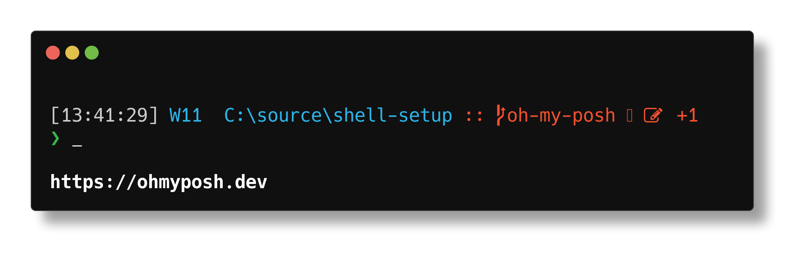

# My shell setup

This is a repository with things I want/need to setup my shell.

My setup consists of:
- Windows terminal with powershell 7 (pwsh) on Windows 11
- Bash in ubuntu on WSL

## Prerequisites

The scripts in this repo takes care of most of the setup but some things need to be installed manually beforehand:
- Windows Terminal (should come pre-installed on Windows 11)
- Powershell 7 (can be installed with winget)
- WSL

## Components

### oh-my-posh

My profile for oh-my-posh is like a mix between `emodipt` and `negligible` with some minor updates and this is what it looks like on Windows 11. In Wsl it would say `WSL` instead of `W11`.



### Fonts

Has a zip-file that contains Meslo LG M Regular nerd fonts, as well as scripts to install them for both windows 10/11 and ubuntu

### Git magic 

Provides convenience functions/aliases for git for both bash and powershell, complete with git autocomplete where applicable.

## Installation

Set up can be done quite easily by running the scripts. After running the scripts the terminal environments expect things to be in the paths specified, so if you move anything around you might need to manually remove stuff from your profiles and run the setup scripts again.

### Windows

1. Run `./install.ps1`
2. Run `./setup.ps1`
3. Add the following to the `defaults` section of the `settings.json` in Windows Terminal:
```json
"fontFace": "MesloLGM NF",
"colorScheme": "One Half Dark",
"suppressApplicationTitle": true
```

### Ubuntu/WSL

1. Run `sudo ./install.sh`
2. Run `./setup.sh`

There might be additional setup needed in pure ubuntu to get the terminal to show the right font. For the Ubuntu setup these scripts have only been run in WSL and displayed in the Windows Terminal.

## Contributing

This repository only exists to make my life easier and while I'm happy to take feature suggestions I will only accept ones that make sense for me. Feel free to fork and make any changes you need to have it make sense for you, or simply use it as inspiration.